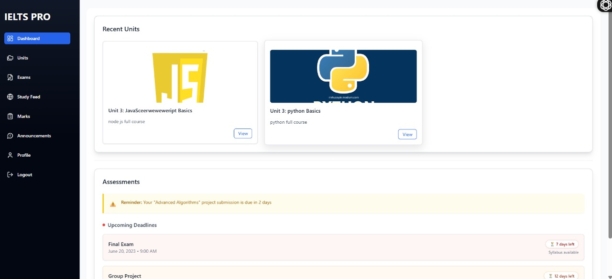
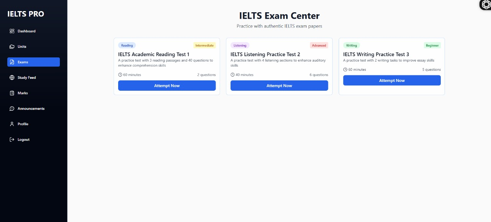
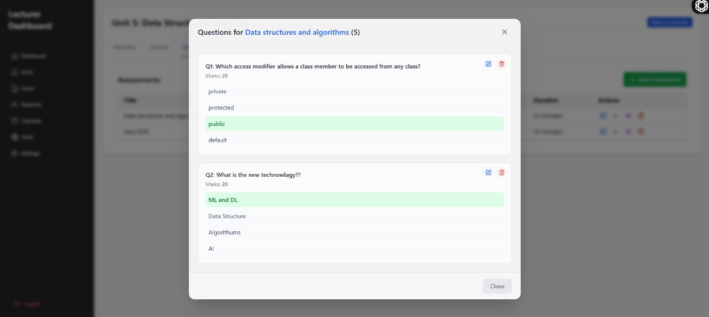
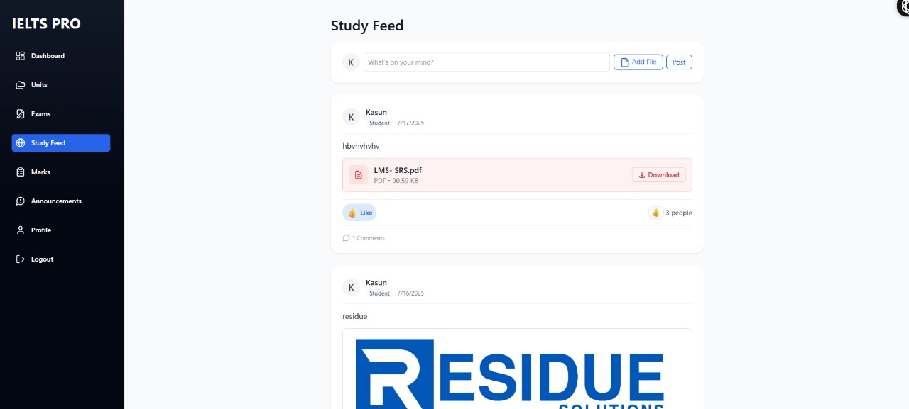

# IELTSMaster LMS

## Screenshots
Below are key screenshots showcasing Suite's core functionalities:

## Special Features
- **IELTS Exam Platform**: Interactive modules for speaking, reading, and writing tests with real-time scoring.
- **Dynamic Community Feed**: Enables user interaction for sharing resources and study tips.
- **AWS S3 Integration**: Secure storage for exam materials and user submissions using pre-signed URLs.
- **Responsive UI**: Enhanced mobile and desktop experience with Tailwind CSS, improving UX by 45%.
- **Optimized Performance**: Reduced API latency by 30% through async operations and MongoDB query enhancements.

## Tech Stack
- **Frontend**: React, Tailwind CSS
- **Backend**: Node.js, Express.js
- **Database**: MongoDB with Mongoose
- **Storage**: AWS S3 for secure file management
- **Tools**: Vite, ESLint, Prettier

## Contributors
- [Ramesh Edirisinghe](https://github.com/RameshEdirisinghe) - Full-stack development
- [Sahan Chamara](https://github.com/SahanChamara) - Full-stack development
- [Harsha Madushan](https://github.com/Harsha24798) - Full-stack development
- [Nipun Bassnayak](https://github.com/NipunBasnayake) - Backend Development
- [Rusiru Pramod](https://github.com/RusiruPramod) - Frontend Development
